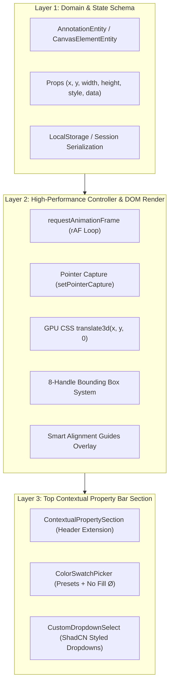

# INTERACTIVE CANVAS ELEMENT SPECIFICATION & BUILDER GUIDE

Tài liệu này quy định **Kiến trúc chuẩn (Architecture Standard)**, **Vòng đời tương tác (State Machine)**, **Tối ưu hiệu năng 60 FPS (Zero-Lag Architecture)**, và **Hướng dẫn từng bước (Implementation Blueprint)** để phát triển các đối tượng tương tác trên Slide Canvas (như Khung chữ/Text Box, Hình khối/Shape, Bảng/Table, Hình ảnh/Image) trong dự án `teaching-app`.

---

## 1. TRI-LAYER ARCHITECTURE (KIẾN TRÚC 3 LỚP CHUẨN)

Mọi đối tượng canvas tương tác (Interactive Canvas Element) trong hệ thống bắt buộc tuân theo kiến trúc 3 lớp phân tách rõ ràng:



---

## 2. NGUYÊN TẮC TỐI ƯU HIỆU NĂNG 60 FPS (ZERO-LAG PRINCIPLES)

1. **Tuyệt đối không trigger React Re-render liên tục trên `pointermove`:**
   - Trong quá trình di chuyển (drag) hoặc co giãn (resize), **không** cập nhật React State `(x, y, width, height)` theo từng pixel.
   - Sử dụng `requestAnimationFrame` (rAF) kết hợp biến đổi trực tiếp thuộc tính DOM element qua `ref.current.style.transform = translate3d(x, y, 0)` và `ref.current.style.width / height`.
   - Bổ sung `will-change: transform, width, height` trong lúc kéo và trả về `will-change: auto` khi kết thúc.
   - Chỉ commit tọa độ/kích thước thực tế vào React State/Store duy nhất một lần khi nhả chuột (`pointerup`).

2. **Pointer Capture chống trượt chuột:**
   - Mọi sự kiện `pointerdown` trên khối hoặc điểm neo phải gọi `e.currentTarget.setPointerCapture(e.pointerId)`.
   - Đảm bảo khi người dùng kéo nhanh trỏ chuột ra ngoài cửa sổ trình duyệt, thao tác drag/resize vẫn được giữ chặt và giải phóng khi `pointerup` (`releasePointerCapture`).

3. **Bounding Box & 8 điểm neo (8-Handle System):**
   - Kích thước hiển thị thị giác: 10x10px góc vuông bo nhẹ, viền xanh `#2563eb`, nền trắng shadow nhẹ.
   - Hitbox cảm ứng/chuột: Mở rộng vùng nhận diện click 20x20px trong suốt xung quanh điểm neo để dễ thao tác trên màn hình cảm ứng.
   - Khóa tỷ lệ góc (`Shift` key): Khi kéo 4 điểm neo góc (`nw`, `ne`, `se`, `sw`) và giữ phím `Shift`, hệ thống bắt buộc bảo toàn tỷ lệ `aspectRatio = initialWidth / initialHeight`.
   - Giới hạn kích thước tối thiểu: Khóa `minWidth = 50px`, `minHeight = 30px` tránh khối bị đảo ngược (flip) hoặc co về 0px.

---

## 3. QUY ĐỊNH THÀNH PHẦN TÁI SỬ DỤNG (REUSABLE UI COMPONENTS)

Để đảm bảo tính đồng bộ UI/UX trên toàn ứng dụng, mọi thanh công cụ thuộc tính phải sử dụng các component dùng chung tại `src/features/ppt-text-box/components/`:

### A. Component Chọn Màu `ColorSwatchPicker`
```tsx
import { ColorSwatchPicker } from '@/features/ppt-text-box/components/ColorSwatchPicker';

<ColorSwatchPicker
  label="Màu nền"
  value={currentBgColor}
  onChange={(color) => updateProps({ fillColor: color })}
  allowTransparent={true} // Bật nút reset "Không màu (No Fill / Ø)"
  type="bg"               // 'text' | 'bg' | 'border'
/>
```
- **Tính năng:**
  - 13 ô màu có sẵn (Presets: Slate, Đỏ, Cam, Vàng, Xanh lá, Cyan, Xanh dương, Tím, Hồng, Trắng, Đen...).
  - Bộ chọn màu tùy chỉnh (`input type="color"`).
  - Nút bấm reset **`[ Ø Không màu (No Fill / Transparent) ]`** dành cho màu nền và màu viền.

### B. Component Dropdown `CustomDropdownSelect`
```tsx
import { CustomDropdownSelect } from '@/features/ppt-text-box/components/CustomDropdownSelect';

<CustomDropdownSelect
  value={currentBorderStyle}
  options={BORDER_STYLE_OPTIONS}
  onChange={(styleVal) => updateProps({ borderStyle: styleVal })}
  title="Kiểu đường viền"
/>
```
- **Tính năng:** Thiết kế chuẩn phong cách ShadCN UI / Radix UI với bo góc, đổ bóng, hỗ trợ xem trước kiểu chữ/đường viền và icon tích chọn (Checkmark).

---

## 4. HƯỚNG DẪN THIẾT KẾ CHO ĐỐI TƯỢNG HÌNH KHỐI (SHAPES BLUEPRINT)

Dành cho các đối tượng hình học tương lai: Hình chữ nhật, Hình tròn, Ngôi sao, Mũi tên, Khối Callout.

### 4.1. Data Schema (`ShapeAnnotationProps`)
```typescript
export interface ShapeAnnotationProps extends AnnotationProps {
  shapeType: 'rectangle' | 'circle' | 'arrow' | 'star' | 'callout';
  fillColor: string;       // Màu nền shape ('transparent' hoặc Hex)
  borderColor: string;     // Màu đường viền ('transparent' hoặc Hex)
  borderWidth: number;     // Độ dày viền (px)
  borderStyle: BorderStyle;// 'solid' | 'dashed' | 'dotted' | 'none'
  borderRadius?: number;   // Bo góc shape (px)
  rotation?: number;       // Góc xoay (độ)
}
```

### 4.2. Top Extended Section (`ShapeContextualSection.tsx`)
Khi người dùng click chọn 1 Shape trên Slide Canvas:
1. Hiển thị Bounding Box 8 điểm neo trên Canvas.
2. Hiển thị `<ShapeContextualSection />` trên thanh công cụ phía trên gồm:
   - `<ColorSwatchPicker label="Màu nền" type="bg" allowTransparent={true} />`
   - `<ColorSwatchPicker label="Màu viền" type="border" allowTransparent={true} />`
   - `<CustomDropdownSelect options={BORDER_STYLE_OPTIONS} />`
   - `<CustomDropdownSelect options={BORDER_WIDTH_OPTIONS} />`
   - Nút xoay shape (Rotate), Nhân bản (Duplicate `Ctrl+D`), Xóa (`Delete`).

---

## 5. HƯỚNG DẪN THIẾT KẾ CHO ĐỐI TƯỢNG BẢNG (TABLES BLUEPRINT)

Dành cho đối tượng Bảng biểu tương tác chuẩn PowerPoint (PPT Table).

### 5.1. Data Schema (`TableAnnotationProps`)
```typescript
export interface TableCell {
  id: string;
  text: string;
  style?: {
    fontSize?: number;
    textColor?: string;
    backgroundColor?: string;
    fontWeight?: 'normal' | 'bold';
    textAlign?: 'left' | 'center' | 'right';
  };
}

export interface TableAnnotationProps extends AnnotationProps {
  rows: number;               // Số hàng (VD: 3)
  cols: number;               // Số cột (VD: 4)
  colWidths: number[];        // Độ rộng từng cột (px)
  rowHeights: number[];       // Độ cao từng hàng (px)
  cells: TableCell[][];       // Mảng 2 chiều chứa dữ liệu ô
  headerRow?: boolean;        // Bật/Tắt hàng Tiêu đề (Header Row style)
  stripedRows?: boolean;      // Hàng xen kẽ màu (Zebra Striping)
  borderColor: string;
  borderWidth: number;
}
```

### 5.2. Vòng đời tương tác Bảng (Table Interaction Machine)
1. **Kéo tổng thể (Table Selection & Move):**
   - Click vào viền ngoài bảng: Xuất hiện 8 điểm neo Bounding Box. Kéo di chuyển toàn bộ bảng với 60 FPS.
2. **Kéo chỉnh kích thước Cột/Hàng (Column/Row Resizing):**
   - Rê chuột vào vạch phân cách giữa 2 cột/hàng: Con trỏ chuyển sang `col-resize` hoặc `row-resize`.
   - Kéo vạch phân cách để thay đổi `colWidths[i]` hoặc `rowHeights[j]`.
3. **Soạn thảo Ô (Cell Editing):**
   - Double-click vào ô `cells[r][c]`: Kích hoạt con trỏ nhập văn bản tại ô đó.
4. **Top Extended Section (`TableContextualSection.tsx`):**
   - Nút Thêm hàng trên / Thêm hàng dưới (`Insert Row`).
   - Nút Thêm cột trái / Thêm cột phải (`Insert Column`).
   - Nút Xóa hàng / Xóa cột (`Delete Row / Column`).
   - Nút Trộn ô (`Merge Cells`) / Tách ô (`Split Cells`).
   - `<ColorSwatchPicker label="Màu nền ô" type="bg" allowTransparent={true} />`
   - `<ColorSwatchPicker label="Màu đường lưới" type="border" allowTransparent={true} />`

---

## 6. QUY TRÌNH HƯỚNG DẪN DÀNH CHO DEVELOPER / AI AGENT

Khi cần thêm bất kỳ loại Canvas Element mới nào vào hệ thống, hãy thực hiện theo đúng 5 bước chuẩn sau:

- [ ] **Bước 1 (Domain Model):** Khai báo thuộc tính trong `AnnotationEntity.ts` và định nghĩa TypeScript Interface trong `src/features/<feature-name>/types/`.
- [ ] **Bước 2 (Controller Hook):** Tái sử dụng `usePPTTextBoxController` hoặc áp dụng rAF transform loop cho đối tượng mới.
- [ ] **Bước 3 (Contextual Section):** Tạo component `<YourElementContextualSection />` trong thanh công cụ mở rộng phía trên, tích hợp `ColorSwatchPicker` và `CustomDropdownSelect`.
- [ ] **Bước 4 (Canvas Overlay Registry):** Đăng ký nhánh render đối tượng trong `AnnotationCanvasOverlay.tsx` và `ToolPropertyBar.tsx`.
- [ ] **Bước 5 (Kiểm thử):** Đảm bảo gõ phím `Delete` để xóa đối tượng, click-outside tự động chuyển tool về `Con trỏ (V)`, và kiểm tra `npm run build` không phát sinh lỗi.
